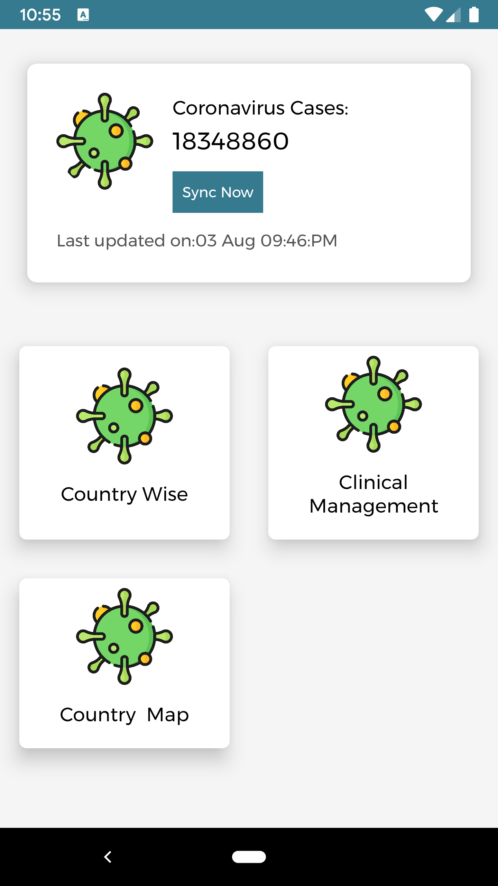

# Covid19Tracker
Simple Covid19Tracker tracking application


## Screens

<p align="center">
  
  
  
  
</p>


## To Run the Application

***You need to add your MAP API key to run the application file***


## Installation
Clone this repository and import into **Android Studio**
 ```bash
git@github.com:samsadch/Covid19Tracker.git
```
            OR
```bash
https://github.com/samsadch/Covid19Tracker.git
```

## Developed
1. MVC
2. Retrofit server call


## Generating signed APK
From Android Studio:
1. ***Build*** menu
2. ***Generate Signed APK...***
3. Fill in the keystore information *(you only need to do this once manually and then let Android Studio remember it)*


## Maintainers
This project is mantained by:
* [Samsad C V](https://github.com/samsadch)


